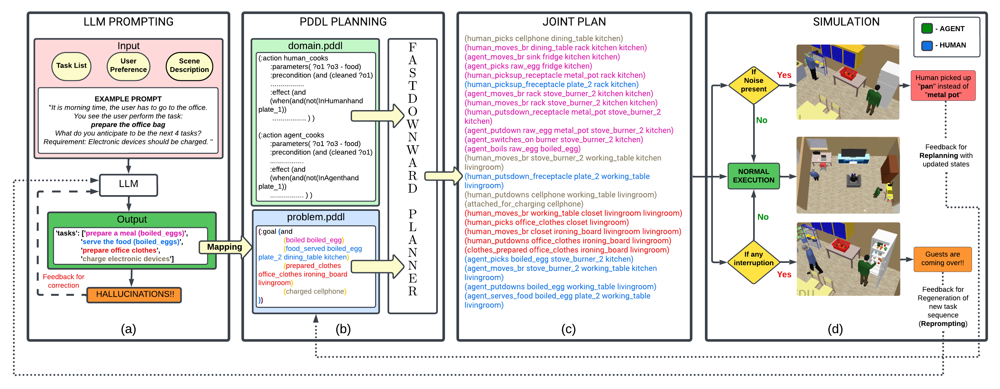

# DaTAPlan Framework for Human-Robot Collaboration



DaTAPlan framework caters to the domain of human-robot collaboration. Specifically, DaTAPlan's planner computes actions for an agent and a human to collaboratively and jointly achieve the tasks anticipated by the LLM, and the agent automatically adapts to unexpected changes in human action outcomes and preferences. We evaluate DaTAPlan's capabilities in a realistic simulation environment, demonstrating accurate task anticipation, effective human-robot collaboration, and the ability to adapt to unexpected changes.

## Installation

1. Install [Anaconda](https://docs.anaconda.com/free/anaconda/install/linux/) for creation of virtual environment.
2. Download [Coppeliasim]() simulator (Edu version) for Ubuntu 20.04.


## Setup

1. Create a conda environment by following the below commands and make sure the python version installed is 3.10.

```
conda create -n hrc-framework
conda install python=3.10
```

2. Activate the environment and install few python packages.

``` 
pip install google-generativeai
pip install opencv-python
pip install matplotlib
```

3. Once you download the Coppeliasim compressed file, unzip it and follow the process to launch the simulation from the terminal. The following steps are **OPTIONAL**.

    * Create a .sh file in your home folder, say sim.sh and add the following content in the shell script.
    ```
    cd Downloads/CoppeliaSim_Edu_V4_6_0_rev8_Ubuntu20_04
    ./coppeliaSim
    ```

    * Edit the .bashrc script and add alias for future access and then source the .bashrc file. Once done open new terminal window and check if the simulator opens by just typing "sim".
    ```
    alias sim="bash /home/<username>/sim.sh"
    ```
Now you can anytime open the simulation without everytime locating the executable file.

4. Clone the repository and inside the cloned repository, unzip the pddl.zip file
```
git clone https://github.com/dataplan-hrc/DaTAPlan.git
cd DaTAPlan
unzip pddl.zip
```

5. Add your Google Gemini API key inside the keyconfig.py file under *utils* folder.


YOU ARE GOOD TO GO!!!

## Execution steps

1. Run the "run_framework.py" file first and generate the anticipated tasks using LLM and plan using PDDL. In between, give the initial location of the agent as per your wish and generate the plan from it.

2. Once the planner stops planning, you can view the generated plan inside the *pddl* folder. Now, you can manually open the simulation file *hrc.ttt* from the simulator and start the simulation.

3. Next, run the "simulation.py" to view the execution of actions of both the human and robot agent in the environment.

## Citation

```
@misc{singh2024anticipate,
      title={Anticipate & Collab: Data-driven Task Anticipation and Knowledge-driven Planning for Human-robot Collaboration}, 
      author={Shivam Singh and Karthik Swaminathan and Raghav Arora and Ramandeep Singh and Ahana Datta and Dipanjan Das and Snehasis Banerjee and Mohan Sridharan and Madhava Krishna},
      year={2024},
      eprint={2404.03587},
      archivePrefix={arXiv},
      primaryClass={cs.RO}
}
```

## License


Licensed under [MIT License](LICENSE)


